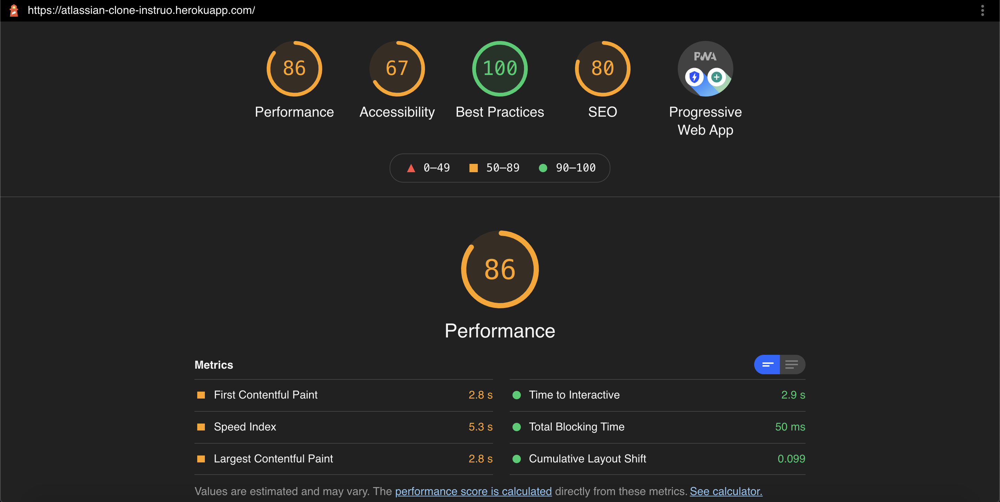
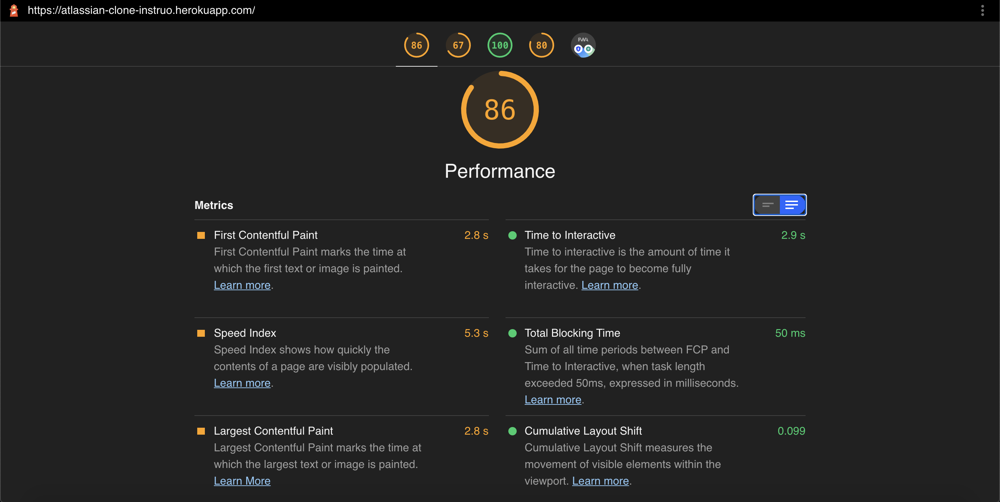
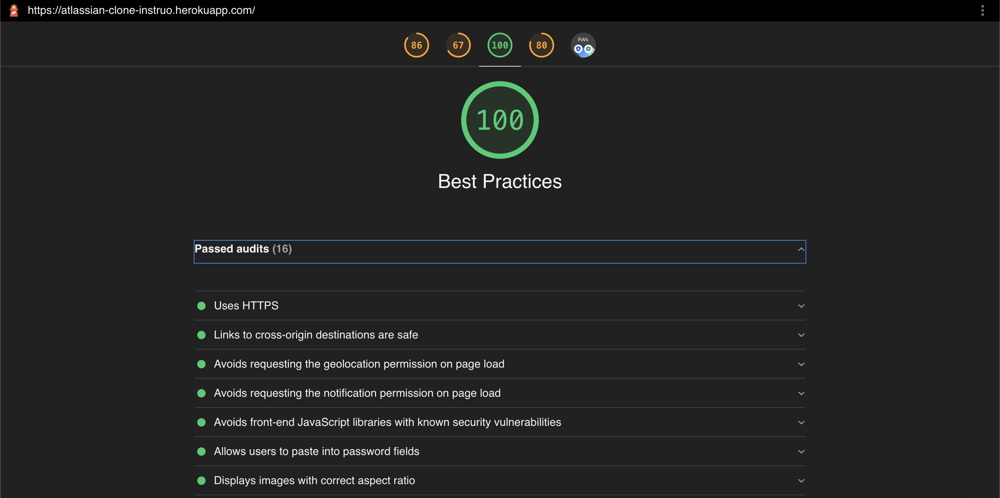
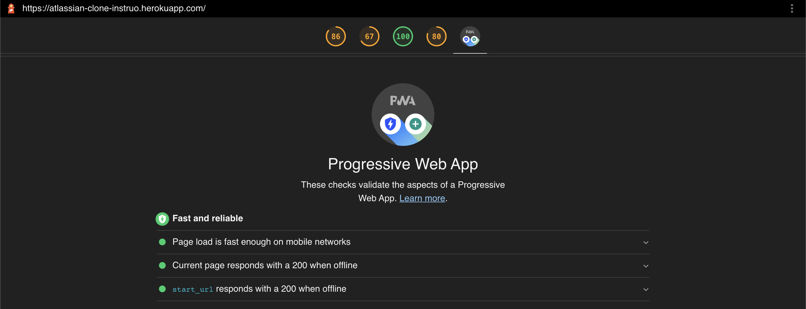
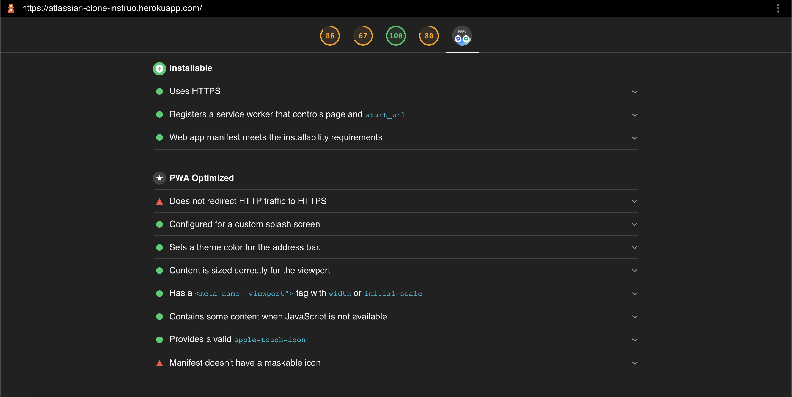

## Instruo Frontend-Task

**Cloning https://www.atlassian.com/software/jira**

**My Website: https://atlassian-clone-instruo.netlify.app/**

### Built Using
1. React
2. Tailwind CSS
3. Followed all basic practices to make it PWA. 

### Lighthouse Stats







### Instructions

1. Clone the repository

    ```git clone https://github.com/Rajdeep-G/Atlassian-clone-INSTRUO.git```

2. Install NPM packages

    ```npm i```

3. Start the app

    ```npm run start```

<hr>
